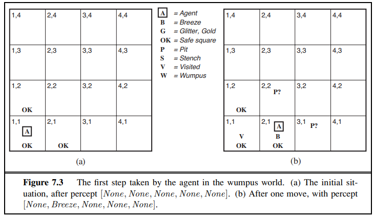
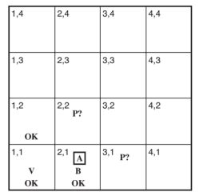
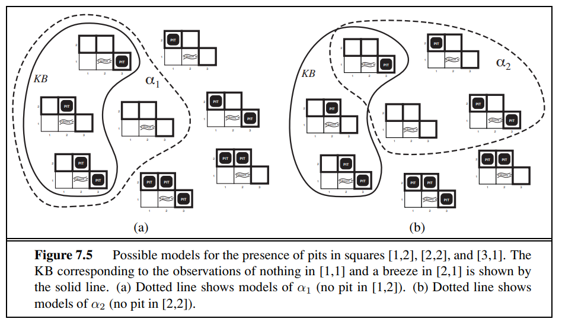
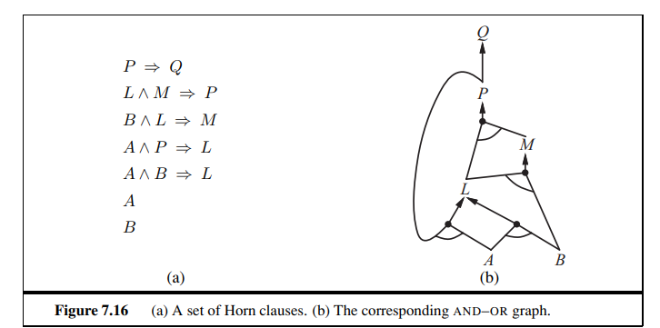

# Logic


## Daftar Isi
- [Logic](#logic)
  - [Daftar Isi](#daftar-isi)
  - [Logical Sentences](#logical-sentences)
    - [Operator untuk Membangun Kalimat Logika](#operator-untuk-membangun-kalimat-logika)
  - [Knowledge-Based Agents](#knowledge-based-agents)
  - [Basis Pengetahuan Proporsisional (Propositional Knowledge Bases)](#basis-pengetahuan-proporsisional-propositional-knowledge-bases)
  - [Wumpus World](#wumpus-world)
    - [The Wumpus World PEAS](#the-wumpus-world-peas)
    - [Contoh Penerapan Wumpus World](#contoh-penerapan-wumpus-world)
  - [Logical Reasoning \& Entailment](#logical-reasoning--entailment)
    - [Logical Reasoning](#logical-reasoning)
    - [Terminologies](#terminologies)
    - [Logical Entailment](#logical-entailment)
    - [Wumpus World Example](#wumpus-world-example)
    - [Logical Inference](#logical-inference)
  - [Inference in Propositional Knowledge Base](#inference-in-propositional-knowledge-base)
    - [1. Truth Table Enumeration](#1-truth-table-enumeration)
    - [2. Proof by Resolution](#2-proof-by-resolution)
      - [Conjunctive Normal Form (CNF)](#conjunctive-normal-form-cnf)
      - [Proof by Resolution](#proof-by-resolution)
      - [Algoritma Resolution](#algoritma-resolution)
      - [Contoh Proof by Resolution](#contoh-proof-by-resolution)
    - [3. Forward \& Backward Chaining (Horn Clauses)](#3-forward--backward-chaining-horn-clauses)
      - [Horn Clauses](#horn-clauses)
      - [Forward \& Backward Chaining](#forward--backward-chaining)
      - [Contoh Forward \& Backward Chaining](#contoh-forward--backward-chaining)


## Logical Sentences

- Kalimat logika atau _logical sentences_ adalah pernyataan yang bisa dinilai benar atau salah. 
- Dalam logika proposisional, kita mulai dari kalimat atomik seperti P ,atau Q yang mewakili fakta sederhana. Kalimat lebih kompleks dibentuk dengan menambahkan penghubung logika seperti “tidak”, “dan”, “atau”. Cara menentukan kebenarannya adalah:

    - Konstanta `True` selalu benar dalam semua model dan `False` selalu salah.
    - Nilai kebenaran setiap simbol proposisi lainnya ditentukan langsung oleh model, contohnya :
        Misalnya kita punya simbol P = “hujan”, Q = “jalan licin”.
        - Dalam satu model, kita bisa tetapkan P = benar, Q = benar.
        - Dalam model lain, bisa saja P = salah, Q = benar.

- Untuk kalimat gabungan, kita lihat nilai setiap bagiannya. Contoh, ¬s (tidak s) benar hanya jika s salah. 


Contoh penerapan dari  kelas `Expr` dari [`logic.py`](https://github.com/kcv-if/Modul-KK/blob/main/Praktikum/2%20-%20Logical%20Agents/logic.py) menyimpan struktur kalimat logika.

Simbol dapat dibuat dengan Expr('P') atau menggunakan fungsi Symbol dan symbols. Operator Python sudah di‑overload sehingga kita bisa menulis kalimat seperti:

```python
from logic import expr, symbols
P, Q = symbols('P Q')       # membuat dua simbol proposisi
sentence = P & ~Q            # merepresentasikan P ∧ ¬Q
another = (P | Q) >> Q       # merepresentasikan (P ∨ Q) ⇒ Q
````

Fungsi bantu `expr` mengurai string menjadi objek `Expr` dan memahami simbol panah `==>`, `<==` dan `<=>` selain operator Python biasa. Kelas `Expr` sendiri tidak menetapkan makna apa pun pada kalimat; ia hanya merepresentasikan sintaksnya.

### Operator untuk Membangun Kalimat Logika


| Operation                | Book | Python Infix Input | Python Output | Python `Expr` Input
|--------------------------|----------------------|-------------------------|---|---|
| Negation                 | &not; P      | `~P`                       | `~P` | `Expr('~', P)`
| And                      | P &and; Q       | `P & Q`                     | `P & Q` | `Expr('&', P, Q)`
| Or                       | P &or; Q | `P`<tt> &#124; </tt>`Q`| `P`<tt> &#124; </tt>`Q` | `Expr('`&#124;`', P, Q)`
| Inequality (Xor)         | P &ne; Q     | `P ^ Q`                | `P ^ Q`  | `Expr('^', P, Q)`
| Implication                  | P &rarr; Q    | `P` <tt>&#124;</tt>`'==>'`<tt>&#124;</tt> `Q`   | `P ==> Q` | `Expr('==>', P, Q)`
| Reverse Implication      | Q &larr; P     | `Q` <tt>&#124;</tt>`'<=='`<tt>&#124;</tt> `P`  |`Q <== P` | `Expr('<==', Q, P)`
| Equivalence            | P &harr; Q   | `P` <tt>&#124;</tt>`'<=>'`<tt>&#124;</tt> `Q`   |`P <=> Q` | `Expr('<=>', P, Q)`


---

## Knowledge-Based Agents

Knowledge-based agents adalah pendekatan AI yang berusaha mencapai kecerdasan dengan menggunakan **pengetahuan** sebagai pusat pengambilan keputusan. Agen jenis ini memiliki kemampuan untuk:

* Menerima tugas baru dalam bentuk tujuan yang dijelaskan secara eksplisit.
* Mencapai kompetensi dengan cepat melalui proses belajar atau diberi pengetahuan baru tentang lingkungannya.
* Beradaptasi terhadap perubahan lingkungan dengan memperbarui pengetahuan yang relevan.

Komponen utama dari agen ini adalah **knowledge base (KB)**, yaitu sekumpulan kalimat atau pernyataan yang dinyatakan dalam bahasa representasi pengetahuan (*knowledge representation language*). Dari KB inilah agen melakukan proses **inferensi**, yaitu menghasilkan representasi atau kalimat baru berdasarkan pernyataan yang sudah ada. Proses inferensi ini yang memungkinkan agen membuat kesimpulan tentang tindakan yang perlu dilakukan.

Untuk berinteraksi dengan KB, terdapat dua operasi penting:

* **TELL(KB, S):** menambahkan kalimat *S* ke basis pengetahuan.
* **ASK(KB, Q):** mengajukan kueri *Q* untuk mengetahui apakah ia merupakan konsekuensi logis dari KB. Jika ya, sistem akan mengembalikan jawaban atau substitusi yang sesuai.

Dengan mekanisme ini, agen mampu membangun representasi dari dunia yang kompleks, melakukan inferensi, dan akhirnya menentukan aksi berdasarkan kesimpulan baru yang diperoleh.


---

## Basis Pengetahuan Proporsisional (Propositional Knowledge Bases)


Dalam logika proposisional, basis pengetahuan didefinisikan sebagai kumpulan pernyataan (kalimat) logika yang dianggap benar oleh agen. Setiap pernyataan menggunakan simbol-simbol logika untuk merepresentasikan fakta tentang dunia (dunia agent).

KB proposisional menjadi pondasi   untuk membangun agen berbasis pengetahuan(KB). Dengan menambahkan (*TELL*) dan menanyakan (*ASK*) kalimat pada KB, agen bisa terus menambah pengetahuan serta menarik kesimpulan baru.

---

## Wumpus World

Wumpus World adalah enviroment yang sering dipakai untuk menggambarkan cara kerja knowledge-based agent. Dunia ini berbentuk gua dengan banyak ruangan yang saling terhubung melalui lorong. Di dalam gua terdapat makhluk berbahaya bernama Wumpus yang akan memangsa siapa saja yang masuk ke ruangannya. Agen hanya dibekali satu panah untuk membunuh Wumpus, sehingga penggunaannya harus sangat hati-hati. Beberapa ruangan juga mengandung lubang  yang bisa menjebak siapa saja yang masuk. Di sisi lain, terdapat emas yang bisa ditemukan sebagai hadiah (Goal Agent).


Tujuan utama agen dalam Wumpus World adalah mencari emas dan kemudian keluar dari gua dengan selamat, sambil menghindari bahaya Wumpus maupun lubang. Untuk mencapai tujuan tersebut, agen harus mengandalkan pengetahuan yang tersimpan dalam knowledge base, mengolah informasi dari persepsi lingkungannya (seperti bau busuk tanda adanya Wumpus atau hembusan angin tanda adanya lubang), lalu menggunakan penalaran logis untuk mengambil keputusan yang tepat.

---


### The Wumpus World PEAS 
* **Performance measure** → bagaimana kinerja agen dinilai
* **Environment** → kondisi/lingkungan tempat agen beroperasi
* **Actuators** → tindakan/aksi yang bisa dilakukan agen
* **Sensors** → informasi/persepsi yang diterima agen

| **PEAS**                | **Deskripsi**                                                                                               |
| ----------------------- | ------------------------------------------------------------------------------------------------------------------- |
| **Performance Measure** | +1000 emas; -1000 mati (lubang/Wumpus); -1 tiap aksi; -10 tembak panah; game selesai saat agen mati atau keluar gua |
| **Environment**         | Grid 4×4; start \[1,1] menghadap kanan; emas & Wumpus random; tiap kotak ≠ start punya peluang 0.2 jadi lubang      |
| **Actuators**           | Forward, TurnLeft, TurnRight, Grab (emas), Shoot (panah), Climb (keluar via \[1,1])                                 |
| **Sensors**             | Stench (dekat Wumpus), Breeze (dekat lubang), Glitter (emas), Bump (dinding), Scream (Wumpus mati)                  |

**Contoh Percept:** `[Stench, Breeze, None, None, None]`

---

### Contoh Penerapan Wumpus World



Agen memulai di kotak [1,1] dengan pengetahuan awal bahwa kotak tersebut aman, ditandai dengan A dan OK. Percept pertama adalah [None, None, None, None, None], sehingga agen dapat menyimpulkan bahwa kotak tetangga [1,2] dan [2,1] juga aman. Agen yang berhati-hati hanya akan bergerak ke kotak yang dipastikan aman. Misalnya, ketika melangkah ke [2,1], agen merasakan breeze (B) yang menandakan kemungkinan adanya lubang di salah satu kotak tetangga([2,2] atau [3,1]). 

maka lubang mungkin ada di [2,2] atau [3,1], ditandai dengan simbol P?. Pada kondisi ini, satu-satunya kotak aman yang belum dikunjungi adalah [1,2], sehingga agen memilih kembali ke [1,1] lalu melanjutkan ke kotak tersebut.


## Logical Reasoning & Entailment

### Logical Reasoning
- Setiap kesimpulan agen **dijamin benar** jika informasi awal (KB) benar.  
- Ini adalah sifat fundamental dari **logika**.

---

### Terminologies
- **Knowledge Base (KB):** kumpulan kalimat.
- **Syntax:** aturan kalimat sah (*well-formed*).  
  - Contoh: `x + y = 4` sah, `x3y+ =` tidak sah.
- **Semantics:** makna/arti kalimat, benar atau salah dalam suatu model.  
  - Contoh: `x + y = 4` benar jika `x=2, y=2`, salah jika `x=1, y=1`.
- **Model (m):** abstraksi matematis dari possible world.  
  - Jika kalimat α benar pada model m → ditulis `m ⊨ α`.  
  - `M(α)` = himpunan semua model dari α.

---

### Logical Entailment
- Definisi: kalimat β **mengikuti** dari α jika semua model α juga model β.  
- Notasi:  
  $\alpha \models \beta \iff M(\alpha) \subseteq M(\beta)$

---

### Wumpus World Example



- **Percepts:** tidak ada apa-apa di [1,1], breeze di [2,1].  
- **Knowledge Base (KB):** berisi aturan + hasil percepts tersebut.  
- Agen ingin tahu apakah [1,2], [2,2], dan [3,1] ada pit.  
- Karena setiap kotak bisa ada pit atau tidak, maka ada **8 kemungkinan model** (2³).  
- **KB salah** pada model yang bertentangan (misalnya [1,2] ada pit, padahal [1,1] tidak ada breeze).  
- Hanya ada **3 model** yang konsisten dengan KB.  


ada  2 kemungkinan kesimpulan:



1. **α1 = “Tidak ada pit di [1,2].”**  
   - Dengan melihat model, pada **setiap model** di mana KB benar, α1 juga benar.  
   - Maka, **KB ⊨ α1** → agen dapat menyimpulkan dengan pasti bahwa tidak ada pit di [1,2].

2. **α2 = “Tidak ada pit di [2,2].”**  
   - Dari model, terlihat bahwa pada **beberapa model** di mana KB benar, α2 justru salah.  
   - Artinya, agen tidak bisa menyimpulkan α2.  
   - Maka, **KB ⊭ α2** → agen **tidak bisa memastikan** apakah [2,2] aman atau berbahaya.  

---

### Logical Inference

- **Entailment** dapat digunakan untuk menarik kesimpulan atau melakukan proses **inferensi logis**.  
- Salah satu algoritma inferensi yang sederhana adalah **model checking**:  
  - Mengecek semua model yang mungkin.  
  - Memastikan bahwa kalimat α benar di semua model di mana **KB** benar.  

## Inference in Propositional Knowledge Base

Tujuan utama: menentukan apakah sebuah kalimat α di-entail oleh basis pengetahuan (KB), ditulis sebagai:

$KB \models \alpha$

---

### 1. Truth Table Enumeration
- Termasuk pendekatan *model checking*.  
- Untuk n simbol → ada 2^n model yang mungkin.  
- Jika KB benar di suatu model, dicek apakah α juga benar.  
- Jika α benar di semua model di mana KB benar → KB ⊨ α.  

kelebiha dari truth table yaitu sederhana dan dapat digunakan untuk semua kalimat proposisional. Namun, kekurangannya adalah tidak efisien untuk jumlah simbol yang besar karena jumlah model tumbuh secara eksponensial.

---

### 2. Proof by Resolution

#### Conjunctive Normal Form (CNF)
- CNF = kalimat logika yang berupa konjungsi (AND, ∧) dari klausa-klausa.  
- Setiap klausa berupa disjungsi (OR, ∨) dari literan.  
- Literan = simbol proposisi (P) atau negasinya (¬P).  

- **Contoh:**  
P ⇔ (Q ∨ R)

1. **Eliminate ⇔**  
   Ganti α ⇔ β dengan (α ⇒ β) ∧ (β ⇒ α)  
   → (P ⇒ (Q ∨ R)) ∧ ((Q ∨ R) ⇒ P)

2. **Eliminate ⇒**  
   Ganti α ⇒ β dengan (¬α ∨ β)  
   → (¬P ∨ Q ∨ R) ∧ (¬(Q ∨ R) ∨ P)

3. **Move negation inwards**  
   Gunakan aturan De Morgan dan double-negation  
   → (¬P ∨ Q ∨ R) ∧ ((¬Q ∧ ¬R) ∨ P)

4. **Apply distributive law (∧ over ∨) dan flatten**  
   → (¬P ∨ Q ∨ R) ∧ (¬Q ∨ P) ∧ (¬R ∨ P)

**Hasil akhir CNF:**  
(¬P ∨ Q ∨ R) ∧ (¬Q ∨ P) ∧ (¬R ∨ P)

- Semua kalimat proposisional bisa diubah ke CNF.  
- Algoritma *resolution* hanya bisa bekerja pada bentuk CNF.

---
#### Proof by Resolution
**Resolution:** sebuah aturan inferensi yang menghasilkan algoritma inferensi lengkap bila dipadukan dengan algoritma pencarian lengkap.  
- Prinsip utama: *proof by contradiction*.  
- Untuk mengecek KB ⊨ α → uji apakah (KB ∧ ¬α) kontradiksi.  
- Jika hasilnya *empty clause* (⊥) → α benar (entailed).  

**Contoh Aturan Resolusi:**  
- (P ∨ Q), ¬P → Q  
- (P ∨ R), (¬P ∨ Q) → (R ∨ Q)  

---

#### Algoritma Resolution
1. Ambil (KB ∧ ¬α) dan ubah ke bentuk **CNF**.  
2. Terapkan aturan **resolusi** pada klausa-klausa hasil konversi.  
3. Ulangi proses resolusi hingga:  
   - Tidak ada klausa baru yang bisa ditambahkan → KB **tidak** meng-entail α, atau  
   - Dua klausa menghasilkan **empty clause (⊥)** → KB **meng-entail** α.  

---

#### Contoh Proof by Resolution

**Kasus:**  
KB = {P ⇒ Q, P}  
Query: α = Q  
Apakah KB ⊨ Q ?

**Langkah 1: Ubah ke CNF**  
1. P ⇒ Q ≡ (¬P ∨ Q)  
   → KB = {¬P ∨ Q, P}  
2. Tambahkan negasi query (¬Q)  
   → {¬P ∨ Q, P, ¬Q}

**Langkah 2: Terapkan Resolusi**  
- (¬P ∨ Q) dan (P) → resolvent = Q  
- (Q) dan (¬Q) → resolvent = ⊥ (empty clause)

**Langkah 3: Kesimpulan**  
Karena muncul empty clause (⊥), maka KB ⊨ Q.  
Artinya: dari P ⇒ Q dan P, benar bahwa Q di-entail oleh KB. 


---

### 3. Forward & Backward Chaining (Horn Clauses)

#### Horn Clauses
- Horn clause = klausa yang punya **maksimal satu literal positif**.  
- Bentuk umum: (¬a ∨ ¬b ∨ ... ∨ z)  
  ekuivalen dengan aturan IF–THEN:  
  (a ∧ b ∧ ...) ⇒ z  
- Jika tepat satu literal positif → disebut *definite clause*.  
- Jika tidak ada literal positif → disebut *goal clause*.  
- **Catatan penting:** Horn clauses tertutup terhadap resolusi → hasil resolusi dua Horn clause juga Horn clause.  

---

#### Forward & Backward Chaining
- **Forward Chaining:**  
  - Mulai dari fakta yang sudah diketahui.  
  - Setiap kali semua premis suatu aturan terpenuhi, simpulan ditambahkan ke KB.  
  - Proses terus berjalan hingga query q muncul, atau tidak ada fakta baru.  
  - Efisien: berjalan dalam waktu linear terhadap ukuran KB.  

- **Backward Chaining:**  
  - Mulai dari query q.  
  - Cari aturan yang kesimpulannya q.  
  - Buktikan semua premis aturan tersebut (dengan backward chaining).  
  - Berhenti jika premis-premis bisa dibuktikan dari fakta yang ada.  
  - Lebih hemat karena hanya menelusuri fakta relevan.  


#### Contoh Forward & Backward Chaining




Query: apakah KB ⊨ Q ?

---

Forward Chaining
- Mulai dari fakta: {A, B}.  
- Aturan 5: A ∧ B ⇒ L → karena A dan B ada → tambahkan L.  
- Fakta sekarang: {A, B, L}.  
- Aturan 3: B ∧ L ⇒ M → karena B dan L ada → tambahkan M.  
- Fakta sekarang: {A, B, L, M}.  
- Aturan 2: L ∧ M ⇒ P → karena L dan M ada → tambahkan P.  
- Fakta sekarang: {A, B, L, M, P}.  
- Aturan 1: P ⇒ Q → karena P ada → tambahkan Q.  
- Fakta sekarang: {A, B, L, M, P, Q}.  
- Query Q bnr terbukti.

---

Backward Chaining
- Query = Q.  
- Cari aturan dengan head Q → P ⇒ Q.  
- Harus buktikan P.  
  - P punya aturan: L ∧ M ⇒ P.  
  - Jadi butuh L dan M.  
    - M: aturan B ∧ L ⇒ M → butuh B dan L.  
    - L bisa didapat dari dua aturan:  
      - A ∧ P ⇒ L (tapi ini siklus, karena butuh P lagi).  
      - A ∧ B ⇒ L (A dan B fakta).  
      → Jadi L benar.  
    - Karena B sudah fakta, maka M juga benar.  
  - Dengan L dan M benar, maka P benar.  
- Karena P benar, Q juga benar.  
- Query Q benar terbukti.
