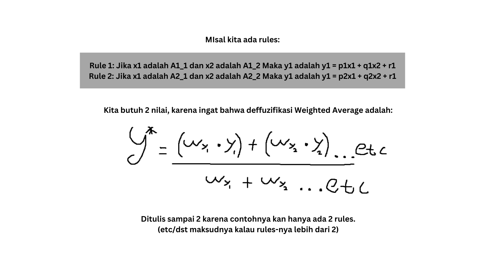
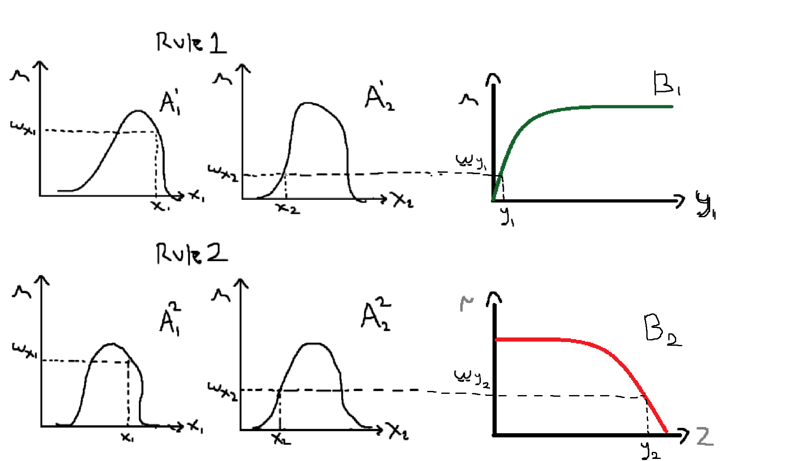
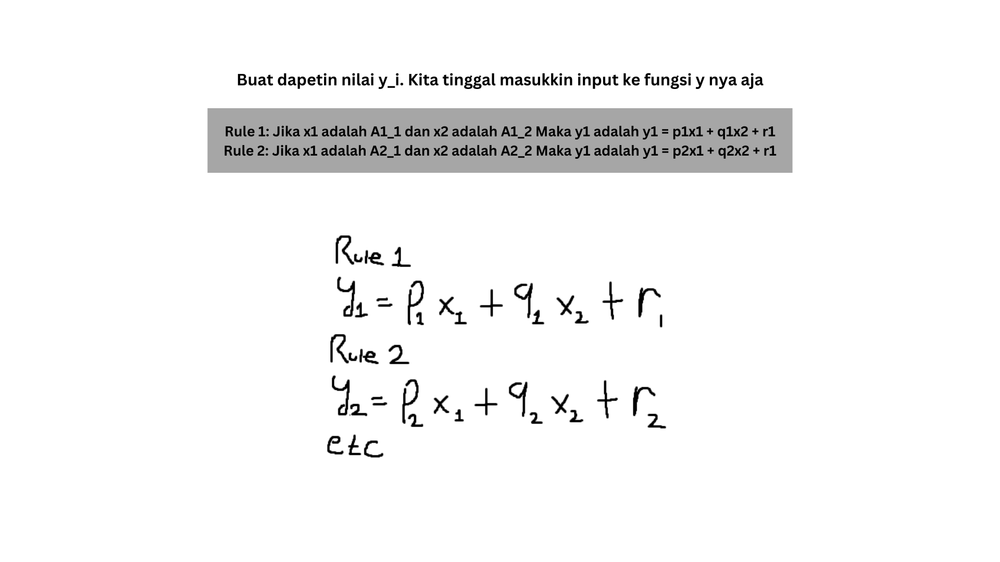
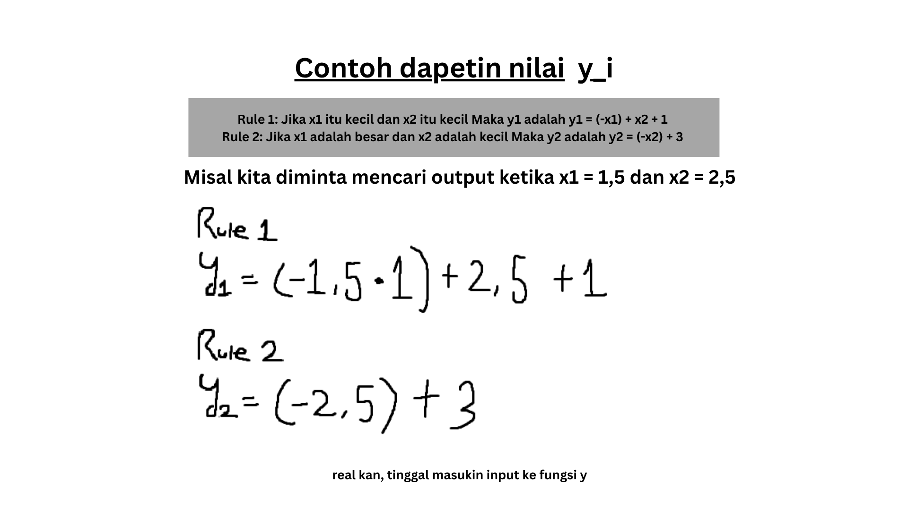

# Inferensi Fuzzy Sugeno 

## Perbedaan dengan Mamdani
Sugeno akan memberikan output yang langsung berbentuk angka (crisp), yang biasanya bentukannya berupa konstanta/fungsi linear dari input.

### Kenapa? 
Sebelumnya kita sudah mengetahui bentuk input dari sistem mamdani adalah 2 antecedents dan 1 consequent, dan mereka semua adalah fuzzy sets/fuzzy number

```
jika x1 adalah A1 dan/atau x2 adalah A2 MAKA y adalah B

# A1, A2, dan B adalah fuzzy number
```

Kalau di Sugeno, dua antecendants tetap merupakan fuzzy (fuzzy sets/numbers), tapi **consequent-nya adalah fungsi matematis dari input** (kayak dari kedua variabel antecendent tersebut)

```
Jika x1 adalah A1 dan x2 adalah A2 MAKA y adalah y=f(x1, x2)

# dimana y = f(x1, x2) adalah consequent dalam bentuk sebuah fungsi crisp (biasanya linear atau konstan terhadap input) 
```

Kalau Konstan **(Zero-order Sugeno)**, aturannya mirip kayak mamdani bedanya ada di outputnya harus crisp

```
Jika x1​ adalah A1​ dan x2​ adalah A2​ MAKA y=c
```

Kalau Linear **(First-order Sugeno)** paling umum, Aturannya kayak yang udah dijelasin sebelumnya
```
Jika x1 adalah A1 dan x2 adalah A2 MAKA y = p1x1 + q1x2 + r

# intinya karena nilai x dikalikan dengan nilai parameter p, makanya nilai outputnya ngga konstan (linear). r it
```

Note paling penting, Pokoknya **setiap aturan akan memiliki output crisp yang diberikan oleh fungsi, sehingga variabel y akan menjadi angka pasti (crisp)**. 

Kenapa ini penting dipahami? Karena pada akhirnya output crisp dari masing-masing aturan akan digabungkan (aggregasi) menggunakan metode *weighted average defuzzification*
 
atau ya intinya, hasil akhir sistem diperoleh dengan menghitung rata-rata dari semua output aturan, di mana bobotnya ditentukan oleh derajat kebenaran (firing strength) masing-masing aturan. 

Anyway, Kita bakal lebih fokus di **First-order Sugeno**

## Tahapan
Pada metode Sugeno, kita akan menyimpan dua nilai utama yang dihasilkan dan digunakan pada setiap aturan.

### Pertama, adalah output fungsi (nilai crisp), yaitu 
**nilai yang didapatkan dengan memasukkan input kedalam fungsi y (*consequent*)**. nilai ini merupakan hasil perhitungan deterministik yang menggambarkan keluaran dari aturan tersebut. biasanya kita menggunakan notasi (y_i)

### Kedua, bobot atau derajat kebenaran (*firing strength*), yaitu 
nilai yang menunjukkan seberapa aktif suatu rule, yang **diperoleh dari proses inferensi pada bagian IF (*antecendent*)**. Nanti biasanya kita menggunakan notasi (w_i), gimana kita dapetin nilai ini? yodah aturan biasa:

- kita ambil **nilai minimum** kalau menggunakan **logika AND**
- kita ambil **nilai maximum** kalau menggunakan **logika OR**
- atau yang jarang digunakan, kita lakukan perkalian antar derajat keanggotaan input terhadap himpunan fuzzy-nya


#### Pada akhirnya, 
kedua nilai tersebut (y_i dan w_i) akan digunakan pada tahap akhir untuk menghitung output sistem menggunakan deffuzifikasi yang sudah dijelaskan sebelumnya (**Weighted Average**)

## Visualisasi

### ⚠️ Eh itu di rule kedua, bukan y1 tapi y2. sory bet ga fokus (malas revisi)



Intinya begini: 

Dimana, $Wy_i$ itu biasanya ditulis sebagai $\alpha$ dan $y_i$ ditulis sebagai $z_i$. dan karena telanjur kita pakai gaya penulisan pertama  

Ini buat mendapatkan nilai Wy_i:

yayaya, maksudnya A2 itu kondisi/antecendent kedua. 

Anyway ini buat mendapatkan nilai y_i: 


dan ini contohnya:


### udah deh, tinggal hasil dari wy_i dan y_i nanti dimasukkin ke rumus deffuzifikasi-nya

Kalau ada pertayaan, tanyakan aja di gc wa yak atau nggak kesini 👉 <a>https://chatgpt.com/</a>


