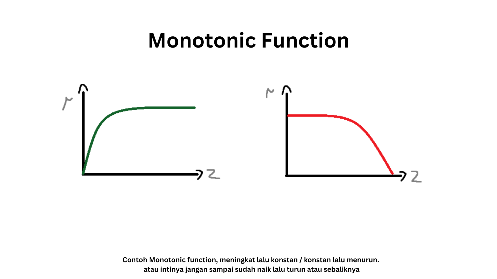
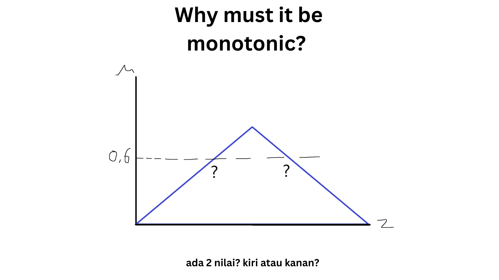

# Tsukamoto Inference
Sebelumnya kita udah bahas <a href="../Fuzzy Mamdani/Readme.md">Mamdani</a> dan <a href="../Fuzzy Sugeno/README.md">Sugeno</a>. Disini adalah inference terakhir yang akan kita bahas yaitu Tsukamoto

## Apa bedanya?
Hmm, buat ngeringkas (karena di materi sugeno udah dibahas perbedaan mamdani dan sugeno) pokoknya perbedaan mamdani dan sugeno dulu:

| Aspek | Mamdani | Sugeno |
|:------|:--------|:--------|
| **Tipe Output (Consequent)** | Fuzzy (berupa himpunan fuzzy) | Numerik (konstanta atau fungsi linear dari input) |
| **Proses Defuzzifikasi** | **Wajib dilakukan** (umumnya dengan metode centroid) | **Tidak perlu defuzzifikasi**, karena output sudah berupa nilai crisp |
| **Kompleksitas Komputasi** | Lebih **tinggi**, karena memerlukan defuzzifikasi | Lebih **rendah**, karena langsung menghasilkan nilai crisp |
| **Contoh Rule** | *IF suhu is tinggi AND kelembapan is rendah THEN kipas is cepat* | *IF suhu is tinggi AND kelembapan is rendah THEN output = 0.7 × suhu + 0.3 × kelembapan + 2* |
| **Aplikasi Umum** | Kontrol kualitas, sistem pakar, penilaian subjektif | Sistem kontrol real-time, prediksi, dan optimisasi industri |

Dan kalau Tsukamoto *Antecendents*-nya masih sama yaitu fuzzy sets dan *consequentnya*-nya juga  fuzzy sets. Sehingga:
```
jika x1 adalah A1 dan/atau x2 adalah A2 MAKA y adalah B
```

Well, lantas apa bedanya dengan Mamdani? 

perbedaan utamanya terletak pada fungsi keanggotaan (membership function) dari si *consequent*-nya (atau variabel output si *y*) yang pada metode **Tsukamoto** akan berupa *monotonic function*. sehingga aturan fuzzy akan menghasilkan nilai crisp melalui pembalikan (invers) dari fungsi keanggotaan tersebut. atau bahasa sederhananya, output dari setiap aturan tidak lagi berbentuk himpunan fuzzy yang luas, tetapi berupa nilai tunggal (crisp) yang ditentukan berdasarkan seberapa kuat aturan tersebut aktif (firing strength)

### Apa itu Monotonic Function
Monotonic Function atau kadang disebut *Shoulder Function*, adalah fungsi keanggotaan yang nilainya selalu meningkat atau selalu menurun terhadap domain variabelnya. Artinya, nilainya tidak boleh naik lalu turun (atau sebaliknya). 

hmm.. karena kita tidak boleh sampai membentuk segitiga, trapesium atau ya pokoknya bentuk lain yang menyebabkan tidak bisa dibalik dengan pasti jadi ga punya invers unik. alias satu nilai derajat keanggotaan bisa merepresentasikan dua nilai berbeda

karena pada akhirnya tujuannya dari monotonic function ini adalah memastikan setiap firing strength dapat dikonversi menjadi satu nilai crisp yang pasti



hmm kayaknya aku mau agak tekenin bagian ini, kenapa kita ga boleh kalau kurvanya membentuk segitiga (atau semacamnya yang ada naik terus turun/sebaliknya lah). Jadi gini

Di metode Tsukamoto, setiap aturan/rule menghasilkan output crisp ($Z_i$) pada sumbu horizontal/sumbu x (output) yang memiliki derajat keanggotaan ($\mu$) = $\alpha$. atau kucontohin:

Misalnya rule: *JIKA Suhu adalah tinggi Maka kipas cepat*. dari inputnya kita dapatkan **$\alpha_i$ = 0.6**. sekarang kita buka kurva fuzzy untuk kategori **cepat** (si output tadi). Lalu cari titik di kurva itu dimana $\mu$ = 0.6. Udah deh, kita lihat nilai z (kecepatan) yang cocok -> itu hasil inversnya

Nah masalahnya gimana kalau kurvanya membentuk segitiga? well...


Mungkin muncul pertanyaan
> wait tapi misalnya naik terus konstan, yang pas bagian konstan (plateu atau bidang datarnya lah) bukannya semua nilai z memiliki nilai miu ($\mu$) nya sama semua ya? ga unik dong?

nice question, intinya tsukomoto ini secara strict harus monotonic, jadi ya bagian plateu-nya (datar-nya) ga boleh dipakai. Kenapa?
karena prosesnya membutuhkan operasi invers:
$$
\mu_{\text{output}}(z_i) = \alpha_i
$$

dan harus bisa dibalik untuk mendapatkan 

$$
z_i = \mu_{\text{output}}^{-1}(\alpha_i)
$$

> cara bacanya artinya intinya nya nya nya kita cari nilai $z$ di fungsi keanggotaan output (consequent) yang memiliki derajat keanggotaan = $α_i$.

kalau fungsinya tidak strictly monotonic (ada daerah konstan), invers-nya tidak tunggal (multi-valued)

#### Lantas gimana?'
ketika kita menggunakan shoulder function (naik terus datar atau turun terus datar). ini masih bisa kita pakai selama kita hanya menggunakan bagian monotonic-nya doang buat proses invers. 

Jadi bagian datarnya ($\mu = 1$) dianggap "saturasi penuh", atau bagian dimana keanggotaan sudah maksimal alias sistem udah "jenuh" di nilai tertinggi dari himpunan fuzzy itu

misalnya kita ada himpunan fuzzy untuk "suhu panas" kayak gini

$$
\mu(z) =
\begin{cases}
0, & z \le 30 \\
\dfrac{z - 30}{40 - 30}, & 30 < z < 40 \\
1, & z \ge 40
\end{cases}
$$
kalau suhu (z) = 45 maka $\mu = 1$ -> "panas sepenuhnya" ga ada derajat keanggotaan yang lebih tinggi lagi. Jadi bagian $\mu = 1$ tadi disebut "saturasi penuh" (atau ya boleh "plateu maksimum"). 

Tapi... secara nilai $\mu$ jarang banget pas = 1. biasanya hasil operasi fuzzy itu hasilnya < 1, kecuali semua kondisi benar benar sempurna. dan kalau bisa nilai-nya 1? kita bisa ambil **nilai batas bawah plateu**. Contoh:

Untuk μ = 1, z bisa 80, 81, 82, dst. (kan ngga unik), kita ambil 80-nya saja. karena ketika sudah "jenuh", sistem menganggap-nya sudah maksimal. jadi kita tidak mencari nilai lebih besar lagi, cukup ambil batas awal saturasi-nya.


### Tahapan
Ok buat tahapan sebenernya sama aja kayak sugeno, bedanya cuman gimana kita dapetin $z_i$ buat nentuin output tiap rule ($z_i$)

Jadi,

| Langkah                                 | **Sugeno**                                                                                                                                                | **Tsukamoto**                                                                                                                         |
| :-------------------------------------- | :-------------------------------------------------------------------------------------------------------------------------------------------------------- | :------------------------------------------------------------------------------------------------------------------------------------ |
| **(1) Fuzzifikasi**                     | Sama aja, ubah input crisp jadi derajat keanggotaan fuzzy                                                                                                    | Sama                                                                                                                                  |
| **(2) Inferensi (Rule Evaluation)**     | Hitung **firing strength αᵢ = μA(x) × μB(y)** (atau min).                                                                                                 | Sama                                                                                                                                  |
| **(3) Penentuan Output Tiap Rule (zᵢ)** | Gunakan **fungsi linear atau konstanta** (misal zᵢ = 0.4x + 0.6y + 2).                                                                                    | Dapatkan zᵢ dari **fungsi keanggotaan output yang monoton** dengan cara **membalik (invers) μ_output(zᵢ) = αᵢ**.                      |
| **(4) Agregasi / Kombinasi Rule**       | Hitung **rata-rata tertimbang:**  | Sama persis:  |
| **(5) Defuzzifikasi**                   | Tidak dilakukan eksplisit, karena hasil sudah crisp.                                                                                                      | Sudah implicit di tiap rule (waktu cari zᵢ dari μ_output⁻¹).                                                                          |


